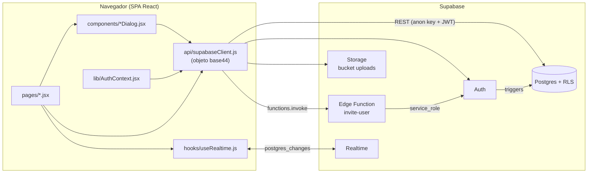
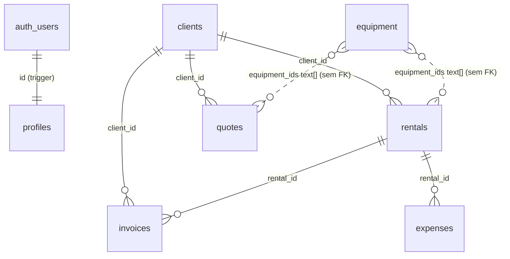

<div align="center">

# StageGear Dashboard

**Painel administrativo para empresas de locação de equipamentos de palco e eventos**

Inventário, clientes, locações, orçamentos, notas fiscais e financeiro, com atualização em tempo real entre usuários.


</div>

---

## Sumário

1. [Visão geral](#1-visão-geral)
2. [Stack](#2-stack)
3. [Arquitetura](#3-arquitetura)
4. [Estrutura de pastas](#4-estrutura-de-pastas)
5. [Rodando localmente](#5-rodando-localmente)
6. [Variáveis de ambiente](#6-variáveis-de-ambiente)
7. [Scripts](#7-scripts)
8. [**Guia de manutenção: onde mexer em cada coisa**](#8-guia-de-manutenção-onde-mexer-em-cada-coisa)
9. [Camada de dados (`base44`)](#9-camada-de-dados-base44)
10. [Banco de dados (Supabase)](#10-banco-de-dados-supabase)
11. [Autenticação e permissões](#11-autenticação-e-permissões)
12. [Regras de negócio](#12-regras-de-negócio)
13. [Build e deploy](#13-build-e-deploy)
14. [Convenções do projeto](#14-convenções-do-projeto)
15. [Troubleshooting](#15-troubleshooting)
16. [Pendências e pontos de atenção](#16-pendências-e-pontos-de-atenção)
17. [Histórico e decisões](#17-histórico-e-decisões)

---

## 1. Visão geral

### O problema

Empresas que alugam som, iluminação, estrutura e palco costumam controlar inventário, contratos e cobranças em planilhas separadas. Com isso fica difícil responder rapidamente "o que está disponível?", "quem está devendo?" e "quanto entra por mês?".

### A solução

Um painel web multiusuário em que a equipe cadastra equipamentos e clientes, registra locações, monta orçamentos, arquiva notas fiscais e acompanha o financeiro. Tudo é sincronizado em tempo real entre os usuários.

O sistema é uma **SPA React estática** que conversa **direto com o Supabase** (Postgres com RLS, Auth, Storage, Realtime e Edge Functions). **Não existe servidor de aplicação próprio.**

### Telas

| Rota | Página | O que faz |
|---|---|---|
| `/login` | Login | Login por e-mail e senha; "Esqueceu a senha?" |
| `/` | Dashboard | KPIs (MRR, TCV, locações ativas), receita dos últimos 6 meses, status dos equipamentos |
| `/equipamentos` | Equipamentos | Inventário: categoria, nº de série, localização, quantidade, valor, status |
| `/clientes` | Clientes | Cadastro de clientes PF/PJ |
| `/locacoes` | Locações | Contratos: cliente, equipamentos, período, valor, status de pagamento e de locação, bonificação |
| `/notas-fiscais` | Notas Fiscais | Registro de NFs com upload do PDF e vínculo opcional a uma locação |
| `/financeiro` | Financeiro | Abas: Fluxo de Caixa, Gastos, Contas a Pagar, **Orçamentos**, Bonificações, Alertas |
| `/configuracoes` | Configurações | Perfil, tema claro/escuro e **gestão de usuários** (convite, papel, arquivar, excluir) |

> 📸 Sugestão: adicionar capturas de tela em `docs/assets/` e referenciá-las aqui.

---

## 2. Stack

| Camada | Tecnologia | Onde aparece |
|---|---|---|
| UI | React 18 + Vite 6 | `src/`, `vite.config.js` |
| Roteamento | React Router 6 | `src/App.jsx` |
| Estilo | Tailwind CSS 3 + shadcn/ui (Radix) | `src/index.css`, `tailwind.config.js`, `src/components/ui/` |
| Acesso a dados | `@supabase/supabase-js` 2 | `src/api/supabaseClient.js` |
| Cache | TanStack Query 5 | Usado só em `src/pages/Financeiro.jsx` |
| Gráficos | Recharts | `src/pages/Dashboard.jsx` |
| Datas | Moment.js | Dashboard, Locações, Notas Fiscais |
| Ícones | lucide-react | Todo o app |
| Backend | Supabase | `supabase/schema.sql`, `supabase/functions/` |
| Edge Functions | Deno | `supabase/functions/*/index.ts` |
| Entrega | Docker (Node 20 → Nginx 1.27) ou Apache estático | `Dockerfile`, `nginx.conf`, `public/.htaccess` |

---

## 3. Arquitetura



**Princípios que guiam o código:**

1. **Toda leitura e escrita passa por um único arquivo:** [`src/api/supabaseClient.js`](src/api/supabaseClient.js). As telas nunca chamam `supabase.from()` diretamente (exceções: Login e AuthContext).
2. **A segurança está no banco (RLS),** não no front. A chave `anon` é pública por natureza; o que um usuário pode fazer é decidido pelas políticas em [`supabase/schema.sql`](supabase/schema.sql).
3. **Operações privilegiadas ficam no servidor:** o convite de usuário (Edge Function com `service_role`) e a exclusão de usuário (função SQL `delete_user`).
4. **Tempo real por recarga:** cada tela assina as tabelas de que depende e recarrega tudo quando algo muda.

---

## 4. Estrutura de pastas

```text
.
├── public/
│   ├── .htaccess                 # Fallback de SPA + cache (hospedagem Apache/Hostinger)
│   └── favicon.svg               # Ícone da aba
├── src/
│   ├── main.jsx                  # Entry point (monta <App/>)
│   ├── App.jsx                   # ⭐ Rotas + guarda de autenticação (RequireAuth)
│   ├── index.css                 # ⭐ Tokens de tema (cores, raio, fonte) claro/escuro
│   ├── api/
│   │   ├── supabaseClient.js     # ⭐ Cliente Supabase + adaptador base44 (camada de dados)
│   │   └── base44Client.js       # Só reexporta o adaptador (compatibilidade)
│   ├── lib/
│   │   ├── AuthContext.jsx       # ⭐ Sessão, usuário logado, bloqueio de arquivados
│   │   ├── query-client.js       # Configuração do TanStack Query
│   │   ├── utils.js              # cn() para classes Tailwind
│   │   └── PageNotFound.jsx      # Página 404
│   ├── hooks/
│   │   ├── useRealtime.js        # Assina mudanças no Postgres e recarrega a tela
│   │   └── use-mobile.jsx        # Usado pelo componente sidebar do shadcn
│   ├── pages/                    # Uma página por rota (ver seção 1)
│   ├── components/
│   │   ├── Layout.jsx            # Sidebar (menu) + área de conteúdo
│   │   ├── DataTable.jsx         # Tabela com busca usada em todas as listagens
│   │   ├── StatusBadge.jsx       # Cores de cada status
│   │   ├── AdminUsers.jsx        # Gestão de usuários (aba Administração)
│   │   ├── <Entidade>Dialog.jsx  # Formulário de criar/editar/excluir de cada entidade
│   │   └── ui/                   # Componentes shadcn/ui (gerados; evite editar)
│   └── utils/index.ts            # createPageUrl (legado, sem uso)
├── supabase/
│   ├── schema.sql                # ⭐ Tabelas, triggers, RLS e bucket (idempotente)
│   └── functions/
│       ├── invite-user/          # Edge Function: convite de usuário (em uso)
│       └── admin-user/           # Edge Function: exclusão via API admin (sem uso no front)
├── Dockerfile                    # Build multi-stage Node → Nginx
├── nginx.conf                    # SPA fallback + cache + gzip (container)
├── DEPLOY.md                     # Passo a passo detalhado: Supabase + Hostinger
├── .env.example                  # Modelo de variáveis de ambiente
├── components.json               # Configuração do shadcn/ui
├── tailwind.config.js            # Tema Tailwind (mapeia os tokens do index.css)
├── vite.config.js                # Alias @ → src
└── eslint.config.js              # Regras de lint
```

⭐ = arquivos centrais; leia-os antes de alterar comportamento.

---

## 5. Rodando localmente

### Pré-requisitos

| Ferramenta | Versão | Observação |
|---|---|---|
| Node.js | 20 LTS | Mesma versão do `Dockerfile` |
| npm | 9+ | Use `npm` (há `package-lock.json`) |
| Projeto Supabase | — | Use um projeto **de desenvolvimento**, não o de produção |
| Supabase CLI | opcional | Só para publicar Edge Functions |

### Passo a passo

```bash
# 1. Instalar
git clone https://github.com/NycollasMartins/Dashboard_Multi_Locacoes.git
cd Dashboard_Multi_Locacoes
npm install

# 2. Configurar o ambiente
cp .env.example .env.local
#    preencha VITE_SUPABASE_URL e VITE_SUPABASE_ANON_KEY (seção 6)

# 3. Rodar
npm run dev        # http://localhost:5173
```

### Preparar o banco (uma vez por projeto Supabase)

1. **SQL Editor** → cole todo o [`supabase/schema.sql`](supabase/schema.sql) → **Run**. O script é idempotente.
2. **Execute os itens que não estão no script** (seção [10.6](#106-objetos-que-não-estão-no-schemasql)): a função `delete_user` e a publicação Realtime.
3. **Authentication → URL Configuration:** Site URL `http://localhost:5173`; Redirect URLs `http://localhost:5173` e `http://localhost:5173/login`.
4. **Authentication → Users → Add user** com *Auto Confirm User*. **O primeiro usuário criado vira `admin` automaticamente.**

### Checklist rápido

- [ ] `npm run dev` sobe sem erro no console
- [ ] Login funciona e o Dashboard carrega
- [ ] Criar e editar um cliente funciona
- [ ] Abrir em duas abas e alterar algo: a outra aba atualiza sozinha (Realtime)

---

## 6. Variáveis de ambiente

| Variável | Obrigatória | Onde obter | Uso |
|---|:-:|---|---|
| `VITE_SUPABASE_URL` | ✅ | Supabase → Project Settings → API → Project URL | URL do projeto |
| `VITE_SUPABASE_ANON_KEY` | ✅ | Supabase → Project Settings → API → `anon public` | Chave pública. A proteção vem do RLS |

```dotenv
VITE_SUPABASE_URL=https://SEU-PROJECT-REF.supabase.co
VITE_SUPABASE_ANON_KEY=SUA_CHAVE_ANON_PUBLICA
```

- Variáveis `VITE_*` são **embutidas no JavaScript no momento do build**. Mudou o valor? Rode o build de novo.
- **Nunca** coloque a `service_role` no front-end ou em variáveis `VITE_*`. Ela só existe no runtime das Edge Functions, que recebem `SUPABASE_URL`, `SUPABASE_ANON_KEY` e `SUPABASE_SERVICE_ROLE_KEY` automaticamente do Supabase.
- `.env`, `.env.local` e `.env.*.local` já estão no `.gitignore`.

---

## 7. Scripts

| Comando | O que faz | Estado |
|---|---|---|
| `npm run dev` | Servidor de desenvolvimento com hot reload | ✅ |
| `npm run build` | Build de produção em `dist/` | ✅ (aviso de bundle > 500 kB, não bloqueia) |
| `npm run preview` | Serve o `dist/` localmente | ✅ |
| `npm run lint` | ESLint | ⚠️ 1 erro conhecido em `src/hooks/useRealtime.js` (comentário `eslint-disable` de regra não carregada) |
| `npm run lint:fix` | ESLint com correção automática | — |
| `npm run typecheck` | `tsc` sobre JSX | ⚠️ Centenas de erros de tipagem dos componentes shadcn; não afeta o build |

Não há testes automatizados nem pipeline de CI.

---

## 8. Guia de manutenção: onde mexer em cada coisa

> Seção pensada para quem vai dar manutenção. Procure a tarefa na tabela e siga o caminho indicado. Os nomes de constantes ajudam a localizar o ponto exato com a busca do editor.

### 8.1 Mapa rápido

| Quero... | Onde | Como |
|---|---|---|
| **Adicionar/alterar um item do menu lateral** | [`src/components/Layout.jsx`](src/components/Layout.jsx) → `navItems` | Cada item é `{ path, label, icon }`; ícones de `lucide-react` |
| **Criar uma nova página/rota** | [`src/App.jsx`](src/App.jsx) + `pages/` + `Layout.jsx` | Rotas internas ficam dentro do `<Route element={<RequireAuth><Layout/></RequireAuth>}>` |
| **Adicionar um campo a um cadastro** | `supabase/schema.sql` + `components/<Entidade>Dialog.jsx` + `pages/<Entidade>.jsx` | Ver [8.2](#82-receita-adicionar-um-campo) |
| **Criar uma nova entidade (tabela + tela)** | Vários arquivos | Ver [8.3](#83-receita-criar-uma-nova-entidade) |
| **Mudar opções de status** | `components/<Entidade>Dialog.jsx` + [`StatusBadge.jsx`](src/components/StatusBadge.jsx) | Ver [8.4](#84-status-e-categorias) |
| **Mudar categorias** | `const CATEGORIES` em `EquipmentDialog`, `ExpenseDialog`, `AccountPayableDialog` | Ver [8.4](#84-status-e-categorias) |
| **Mudar colunas de uma listagem** | `const columns` em `pages/<Entidade>.jsx` | `accessor` (texto, entra na busca) ou `render(row)` (JSX) |
| **Mudar a busca das tabelas** | [`src/components/DataTable.jsx`](src/components/DataTable.jsx) | Busca no cliente, só em colunas com `accessor` |
| **Mudar KPIs e gráficos do Dashboard** | [`src/pages/Dashboard.jsx`](src/pages/Dashboard.jsx) | Cálculos no início do componente; regras em [12.1](#121-dashboard) |
| **Mudar cálculos e alertas do Financeiro** | [`src/pages/Financeiro.jsx`](src/pages/Financeiro.jsx) | Blocos `// Cash flow calculations` e `// Notifications`; regras em [12.2](#122-financeiro) |
| **Mudar a fórmula do orçamento** | [`src/components/QuoteDialog.jsx`](src/components/QuoteDialog.jsx) → função `set` | `total = subtotal + transporte + montagem + subtotal × imposto%` |
| **Mudar cores, fonte e bordas (tema)** | [`src/index.css`](src/index.css) (`:root` e `.dark`) | Cores em HSL. `--primary` é o laranja da marca |
| **Mudar nome/logo da marca** | `Layout.jsx`, `pages/Login.jsx`, `index.html` (`<title>`), `public/favicon.svg` | O logo é o ícone `Package` do lucide dentro de um quadrado `bg-primary` |
| **Mudar textos da tela de login** | [`src/pages/Login.jsx`](src/pages/Login.jsx) | Painel de marca à esquerda; formulário à direita |
| **Adicionar componente de UI (botão, modal...)** | `src/components/ui/` | `npx shadcn@latest add <componente>` (config em `components.json`) |
| **Mudar regras de acesso a dados** | [`supabase/schema.sql`](supabase/schema.sql) → seção `3. ROW LEVEL SECURITY` | Edite e rode o script no SQL Editor |
| **Mudar papéis de usuário** | `const ROLES` em [`AdminUsers.jsx`](src/components/AdminUsers.jsx) + `handle_new_user` no `schema.sql` | Os papéis válidos hoje são `admin` e `user` (Operador) |
| **Mudar o convite de usuário** | [`supabase/functions/invite-user/index.ts`](supabase/functions/invite-user/index.ts) | Depois: `supabase functions deploy invite-user` |
| **Mudar o texto dos e-mails (convite, senha)** | Painel do Supabase → Authentication → Email Templates | Não está no código |
| **Mudar upload de arquivos** | `integrations.Core.UploadFile` em `supabaseClient.js` | Bucket `uploads`; devolve a URL pública |
| **Fazer uma tela atualizar em tempo real** | `useRealtime("tabela", load)` na página | A tabela precisa estar na publicação Realtime ([10.6](#106-objetos-que-não-estão-no-schemasql)) |
| **Mudar a sessão/login/logout** | [`src/lib/AuthContext.jsx`](src/lib/AuthContext.jsx) | Expõe `useAuth()` |
| **Mudar cache/headers do site em produção** | `nginx.conf` (Docker) ou `public/.htaccess` (Apache) | Os dois fazem a mesma coisa; mantenha-os alinhados |
| **Mudar as variáveis do build Docker** | [`Dockerfile`](Dockerfile) → `ARG VITE_*` | Ver [13.1](#131-docker--easypanel) |

### 8.2 Receita: adicionar um campo

Exemplo: adicionar "Placa do veículo" (`vehicle_plate`) em Locações.

1. **Banco** — em `supabase/schema.sql`, logo após o `create table ... rentals`, adicione de forma idempotente:
   ```sql
   alter table public.rentals add column if not exists vehicle_plate text;
   ```
   Rode o script no SQL Editor.
2. **Formulário** — em `components/RentalDialog.jsx`, adicione o input seguindo o padrão:
   ```jsx
   <div><Label>Placa</Label><Input value={form.vehicle_plate || ""} onChange={e => set("vehicle_plate", e.target.value)} /></div>
   ```
   O `save()` já envia todo o `form`; não precisa mexer na camada de dados.
3. **Listagem (opcional)** — em `pages/Rentals.jsx`, adicione em `columns`:
   ```js
   { key: "plate", label: "Placa", accessor: "vehicle_plate" }
   ```

> ⚠️ Se o campo existir no formulário, mas não no banco, o Supabase recusa a gravação (`column ... does not exist`).

### 8.3 Receita: criar uma nova entidade

Exemplo: Fornecedores (`Supplier` → tabela `suppliers`).

1. **`supabase/schema.sql`**
   - `create table if not exists public.suppliers (id text primary key default gen_random_uuid()::text, name text not null, ..., created_at timestamptz not null default now(), updated_at timestamptz not null default now());`
   - Adicione `'suppliers'` aos **dois** arrays dos blocos `do $$` (trigger de `updated_at` e política RLS).
   - `alter table public.suppliers enable row level security;`
   - Se a tela for usar tempo real: `alter publication supabase_realtime add table public.suppliers;`
2. **`src/api/supabaseClient.js`** → `TABLE_MAP`: adicione `Supplier: 'suppliers'`. A partir daí, `base44.entities.Supplier` já tem `list/filter/get/create/update/delete`.
3. **`src/components/SupplierDialog.jsx`**: copie `ClientDialog.jsx` (o mais simples) e ajuste os campos.
4. **`src/pages/Suppliers.jsx`**: copie `pages/Clients.jsx` e troque entidade, colunas e textos.
5. **`src/App.jsx`**: `<Route path="/fornecedores" element={<Suppliers />} />` dentro do bloco protegido.
6. **`src/components/Layout.jsx`** → `navItems`: `{ path: "/fornecedores", label: "Fornecedores", icon: Truck }`.

### 8.4 Status e categorias

Status e categorias são **strings em português** gravadas como texto livre no banco (não há `ENUM` nem `CHECK`). Os valores válidos são definidos só no front:

| Entidade | Status (onde) | Categorias (onde) |
|---|---|---|
| Equipamento | `STATUSES` em `EquipmentDialog.jsx` | `CATEGORIES` em `EquipmentDialog.jsx` |
| Locação | Arrays inline no JSX de `RentalDialog.jsx` (pagamento e locação) | — |
| Orçamento | `STATUSES` em `QuoteDialog.jsx` | — |
| Nota fiscal | Array inline no JSX de `InvoiceDialog.jsx` | — |
| Gasto | — | `CATEGORIES` em `ExpenseDialog.jsx` |
| Conta a pagar | `STATUSES` em `AccountPayableDialog.jsx` | `CATEGORIES` em `AccountPayableDialog.jsx` |

**Ao adicionar ou renomear um status:**

1. Altere a lista no diálogo.
2. Adicione a cor em `STATUS_COLORS` ([`StatusBadge.jsx`](src/components/StatusBadge.jsx)). Sem isso, o badge fica cinza.
3. **Procure o texto antigo no projeto inteiro.** Vários cálculos comparam strings literais: por exemplo, `"Pago"`, `"Atrasado"`, `"Em andamento"` e `"Mensal"` em `Dashboard.jsx` e `Financeiro.jsx`.
4. Renomeou? Atualize os registros antigos no banco (`update ... set status = 'Novo' where status = 'Antigo'`).

> Os cards de gastos por categoria no Financeiro usam uma lista fixa (`["Transporte", "Montagem", "Imposto"]` em `Financeiro.jsx`), separada de `CATEGORIES`.

### 8.5 Padrão de uma página CRUD

Todas as listagens seguem a mesma estrutura. Entender `pages/Clients.jsx` + `components/ClientDialog.jsx` é entender todas:

```jsx
const load = () => base44.entities.Client.list("-created_date").then(d => { setItems(d); setLoading(false); });
useEffect(() => { load(); }, []);
useRealtime("clients", load);                     // recarrega se alguém alterar

<DataTable columns={columns} data={items}
  onAdd={() => abrirDialogo(null)}               // novo
  onRowClick={row => abrirDialogo(row)} />       // editar
<ClientDialog open item onSaved={load} />        // salvar/excluir → onSaved recarrega
```

Nos diálogos, os campos obrigatórios **desabilitam o botão Salvar** (`disabled={saving || !form.name ...}`). Não há outra validação.

---

## 9. Camada de dados (`base44`)

Arquivo: [`src/api/supabaseClient.js`](src/api/supabaseClient.js). Import usado nas telas:

```js
import { base44 } from "@/api/base44Client";
```

> O nome `base44` é herança da plataforma em que o projeto nasceu ([seção 17](#17-histórico-e-decisões)). Hoje ele é só um adaptador sobre o Supabase.

| API | Assinatura | Comportamento |
|---|---|---|
| `entities.<E>.list` | `list(order?, limit?)` | `select *` ordenado. `"-created_date"` = mais recentes primeiro (padrão) |
| `entities.<E>.filter` | `filter({ campo: valor }, order?)` | Um `.eq()` por chave |
| `entities.<E>.get` | `get(id)` | Um registro |
| `entities.<E>.create` | `create(payload)` | Insere e devolve a linha criada |
| `entities.<E>.update` | `update(id, payload)` | Atualiza e devolve a linha |
| `entities.<E>.delete` | `delete(id)` | `{ success: true }` |
| `entities.User.list / update` | — | Lê e atualiza a tabela `profiles` |
| `auth.me()` | — | `{ id, email, full_name, phone, company, role, archived }` |
| `auth.updateMe(payload)` | — | Atualiza o próprio perfil (ignora `email` e `role`) |
| `auth.logout()` | — | Encerra a sessão e vai para `/login` |
| `users.inviteUser(email, role, fullName)` | — | Chama a Edge Function `invite-user` |
| `users.deleteUser(id)` | — | Chama a RPC `delete_user` |
| `users.setArchived(id, bool)` | — | Arquiva ou reativa o usuário |
| `integrations.Core.UploadFile({ file })` | — | Envia ao bucket `uploads` e devolve `{ file_url }` |

**Entidades** (`TABLE_MAP`): `Client` → `clients`, `Equipment` → `equipment`, `Rental` → `rentals`, `Quote` → `quotes`, `Invoice` → `invoices`, `Expense` → `expenses`, `AccountPayable` → `accounts_payable`.

**Comportamentos automáticos:**

- Cada linha retornada ganha `created_date` e `updated_date` (aliases de `created_at` e `updated_at`).
- Antes de gravar, `id`, `created_*`, `updated_*` e `created_by` são removidos do payload.
- Erros do Supabase são **lançados** (`throw`). Quem chama decide como tratar.
- Não há paginação: `list()` traz a tabela inteira.

---

## 10. Banco de dados (Supabase)

Fonte da verdade: [`supabase/schema.sql`](supabase/schema.sql). Ele é **idempotente** (pode rodar várias vezes) e não há pasta de migrations: toda mudança é feita editando o arquivo e rodando o script de novo.

### 10.1 Modelo



| Tabela | Conteúdo | Campos de destaque |
|---|---|---|
| `profiles` | Espelho de `auth.users` | `role` (`admin`/`user`), `archived`, `archived_at`, `confirmed_at` (null = convite pendente) |
| `clients` | Clientes | `name`, `company`, `cpf_cnpj`, `email`, `phone`, `address` |
| `equipment` | Inventário | `category`, `status`, `quantity`, `purchase_price`, `serial_number`, `invoice_number` (NF de compra) |
| `rentals` | Locações | `client_id`, `client_name`, `equipment_ids[]`, `equipment_names`, `start_date`, `end_date`, `total_value`, `payment_type`, `payment_status`, `rental_status`, `is_bonus` |
| `quotes` | Orçamentos | `subtotal`, `transport_cost`, `assembly_cost`, `tax_percent`, `total_value`, `status` |
| `invoices` | Notas fiscais | `number`, `value`, `issue_date`, `status`, `file_url`, `rental_id` |
| `expenses` | Gastos | `category`, `value`, `date` |
| `accounts_payable` | Contas a pagar | `category`, `value`, `due_date`, `payment_date`, `status` |

### 10.2 Convenções do schema

- **IDs `text`** (default `gen_random_uuid()::text`), para permitir importar IDs antigos não-UUID.
- `created_at` e `updated_at` em todas as tabelas. `updated_at` é mantido por trigger.
- FKs com **`ON DELETE SET NULL`**: excluir um cliente não apaga as locações dele.
- **Nomes desnormalizados:** `client_name` e `equipment_names` são gravados no save. Renomear um cliente **não** atualiza locações antigas.
- Colunas sem uso na interface: `equipment.image_url` e `expenses.rental_id`.

### 10.3 Triggers e funções

| Objeto | O que faz |
|---|---|
| `set_updated_at()` | Atualiza `updated_at` em todo UPDATE |
| `handle_new_user()` | Cria o `profiles` quando um usuário é criado no Auth. **O primeiro vira `admin`**; os demais recebem o `role` enviado no convite, ou `user` |
| `handle_user_confirmed()` | Preenche `profiles.confirmed_at` quando o convite é aceito |
| `is_admin()` | Helper usado no RLS |

### 10.4 RLS (quem acessa o quê)

| Tabela | Regra |
|---|---|
| 7 tabelas de negócio | Qualquer usuário **autenticado** lê e escreve tudo (workspace compartilhado) |
| `profiles` (SELECT) | Qualquer autenticado vê todos os perfis |
| `profiles` (UPDATE) | O próprio usuário (sua linha) ou um admin (qualquer linha) |
| Anônimo | Não acessa nada |

### 10.5 Storage

Bucket **`uploads`**, **público para leitura**. Escrita só para usuários autenticados. É usado pelo PDF das notas fiscais. Excluir uma NF não apaga o arquivo do bucket.

### 10.6 Objetos que não estão no `schema.sql`

O código depende de dois itens que existem **apenas no banco de produção**:

| Item | Usado por | Sem ele |
|---|---|---|
| Função `public.delete_user(uid)` | Botão "Excluir" em Configurações → Administração (`base44.users.deleteUser`) | A exclusão de usuário falha |
| Publicação `supabase_realtime` com as tabelas do app | `useRealtime` | As telas não atualizam sozinhas (o resto funciona) |

**Para um projeto Supabase novo:**

```sql
-- Realtime (ignore as tabelas que já estiverem na publicação)
alter publication supabase_realtime add table
  public.clients, public.equipment, public.rentals, public.quotes,
  public.invoices, public.expenses, public.accounts_payable, public.profiles;
```

A definição de `delete_user` deve ser **exportada do banco de produção** e versionada no `schema.sql`. Ao versionar, garanta que a função **verifica `is_admin()`** e impede o usuário de excluir a si mesmo.

---

## 11. Autenticação e permissões

### Fluxo

```text
/login → signInWithPassword → AuthContext carrega auth.getUser() + profiles
        ├─ profiles.archived = true → signOut → volta ao /login
        └─ ok → RequireAuth libera as rotas internas
```

- Não existe tela de cadastro: usuários entram **por convite** ou são criados no painel do Supabase.
- "Esqueceu a senha?" envia um link com `redirectTo = <origin>/login`.
- A sessão persiste no navegador e o token é renovado automaticamente.

### Ciclo de vida do usuário

| Ação | Onde acontece | Quem pode |
|---|---|---|
| Convidar | Edge Function `invite-user` | Admin (checado na função) |
| Criar perfil | Trigger `handle_new_user` | Automático |
| Aceitar convite | Trigger `handle_user_confirmed` (sai de "Pendentes") | Automático |
| Alterar papel | `profiles.role` | Admin, pela interface |
| Arquivar / reativar | `profiles.archived` | Admin, pela interface |
| Excluir | RPC `delete_user` | Admin, pela interface |

### Papéis

| | Operador (`user`) | Administrador (`admin`) |
|---|:-:|:-:|
| Todas as telas de operação e o financeiro | ✅ | ✅ |
| Ver a lista de usuários | ✅ (somente leitura) | ✅ |
| Convidar, alterar papel, arquivar, excluir | ❌ | ✅ (exceto na própria conta) |

> Os papéis diferenciam apenas a **gestão de usuários**. Para dados de negócio, os dois têm o mesmo acesso.

### Configuração no painel do Supabase

| Local | Valor |
|---|---|
| Auth → URL Configuration | Site URL = domínio do painel; Redirect URLs = domínio e `/login` |
| Auth → Sign In | **"Allow new users to sign up" desligado** (o app só usa convites) |
| Project Settings → Auth → SMTP | SMTP próprio (recomendado para os e-mails de convite) |

---

## 12. Regras de negócio

Todos os cálculos são feitos **no navegador**, sobre a lista completa de registros.

### 12.1 Dashboard

| Indicador | Regra |
|---|---|
| MRR (Mensal) | Soma de `total_value` das locações com `payment_type = "Mensal"` |
| TCV (Parcela Única) | Soma de `total_value` com `payment_type = "Parcela Única"` |
| Locações Ativas | `rental_status = "Em andamento"` |
| Alerta vermelho | Quantidade de locações com `payment_status = "Atrasado"` |
| Receita Mensal (gráfico) | `total_value` agrupado pelo mês de `start_date` (últimos 6 meses) |
| Receita Total | Soma de todas as locações |
| Equipamentos | Quantidade de registros (não soma `quantity`) |

### 12.2 Financeiro

| Indicador | Regra |
|---|---|
| Recebido | Locações `Pago`, **excluindo bonificações** |
| A Receber | Locações `Pendente` ou `Parcial`, excluindo bonificações (soma o valor total) |
| Em Atraso | Locações `Atrasado`, excluindo bonificações |
| Contas a Pagar | Contas com status `Pendente` |
| Saldo Atual | Recebido − todos os gastos |

**Alertas automáticos** (calculados ao abrir a tela):

- 🔴 locação com pagamento `Atrasado`;
- 🔴 conta `Pendente` vencida;
- 🟡 conta `Pendente` que vence em até 7 dias;
- 🟡 locação encerrada (`end_date` < hoje) com pagamento pendente.

> Nenhum status muda sozinho. "Atrasado", "Vencida" e "Alugado" são marcados à mão pelo usuário.

### 12.3 Outras regras

- **Bonificação** (`is_bonus`): locação de parceria, sem custo. Aparece na aba Bonificações e fica **fora** dos totais do Financeiro, mas **entra** nos totais do Dashboard.
- **Orçamento:** `total = subtotal + transporte + montagem + subtotal × imposto% / 100`. O total é recalculado a cada alteração e gravado; o banco não recalcula. Não existe conversão automática de orçamento em locação.
- **Equipamentos de uma locação:** seleção múltipla. O status do equipamento **não** muda automaticamente e não há checagem de conflito de datas.
- **Notas fiscais:** o sistema **arquiva** NFs emitidas em outro lugar (número, valor e PDF). Ele não emite NF.

---

## 13. Build e deploy

```bash
npm run build      # gera dist/ (arquivos estáticos)
```

O código suporta dois alvos. Em ambos, as variáveis `VITE_*` entram **no build**.

### 13.1 Docker / EasyPanel

- [`Dockerfile`](Dockerfile): etapa 1 `node:20-alpine` (`npm ci` + `npm run build`); etapa 2 `nginx:1.27-alpine` servindo `dist/` na porta 80.
- [`nginx.conf`](nginx.conf): fallback de SPA (`try_files ... /index.html`), gzip, cache de 1 ano para assets e `no-cache` no `index.html`.
- **Variáveis:** o `Dockerfile` declara `ARG VITE_SUPABASE_URL` e `ARG VITE_SUPABASE_ANON_KEY` **com valores padrão do projeto de produção**. Para outro ambiente, sobrescreva com build args:

```bash
docker build \
  --build-arg VITE_SUPABASE_URL=https://SEU-PROJECT-REF.supabase.co \
  --build-arg VITE_SUPABASE_ANON_KEY=SUA_CHAVE_ANON_PUBLICA \
  -t stagegear-dashboard .
docker run -p 8080:80 stagegear-dashboard     # http://localhost:8080
```

No EasyPanel, essas variáveis devem ser configuradas como **Build Arguments**. Como variável de runtime não têm efeito, porque o Nginx serve arquivos já compilados.

### 13.2 Hospedagem estática Apache (Hostinger)

Envie **o conteúdo** de `dist/` para a pasta do domínio ou subdomínio, **incluindo o `.htaccess`** (arquivo oculto) e com SSL ativo. Passo a passo completo, com criação do projeto Supabase e migração de dados antigos, em **[DEPLOY.md](DEPLOY.md)**.

### 13.3 Supabase

| Mudou | Ação |
|---|---|
| `supabase/schema.sql` | Rodar o arquivo no SQL Editor (faça backup antes, em Database → Backups) |
| `supabase/functions/invite-user` | `supabase login` → `supabase link --project-ref <ref>` → `supabase functions deploy invite-user` |

### 13.4 Checklist de pré-deploy

- [ ] `npm run build` passa
- [ ] Testado localmente contra um Supabase de **desenvolvimento**
- [ ] Mudanças de banco aplicadas no `schema.sql` (idempotente) e executadas antes do deploy do front
- [ ] Tabela nova: RLS habilitado, política criada e publicação Realtime, se a tela usar `useRealtime`
- [ ] Edge Function alterada foi republicada
- [ ] Nenhuma chave nova no código (`git grep -n "service_role"`)
- [ ] **Após o deploy:** login funciona, recarregar `/financeiro` não dá 404, criar e editar um registro funciona

---

## 14. Convenções do projeto

| Tema | Regra |
|---|---|
| Idioma | Interface, comentários e commits em português; código, tabelas e colunas em inglês |
| Rotas | Português, kebab-case (`/notas-fiscais`) |
| Imports | Alias `@/` → `src/` |
| Dados | Sempre via `base44.*`; não use `supabase.from()` nas telas |
| Formulários | Um `<Entidade>Dialog.jsx` por entidade, com `save()` e `remove()` |
| Moeda | `toLocaleString("pt-BR", { style: "currency", currency: "BRL" })` |
| Banco | Toda mudança vai no `schema.sql`, sempre idempotente (`if not exists`, `create or replace`, `drop ... if exists`) |
| UI base | `src/components/ui/` é gerado pelo shadcn; prefira adicionar componentes a editá-los |
| Commits | Conventional Commits: `feat:`, `fix:`, `docs:`, `chore:`, `refactor:` |

---

## 15. Troubleshooting

| Sintoma | Causa provável | Solução |
|---|---|---|
| Tela branca + aviso de variáveis no console | Build sem `VITE_SUPABASE_*` | Preencher `.env.local` (ou build args) e rebuildar |
| Alterei o `.env.local` e nada mudou | O Vite só lê na inicialização | Reiniciar `npm run dev` |
| 404 ao recarregar `/financeiro` | Fallback de SPA ausente | Apache: subir o `.htaccess`. Docker: conferir o `nginx.conf` |
| `Failed to fetch` / CORS no login | Domínio fora das URLs do Auth ou sem HTTPS | Conferir Site URL e Redirect URLs; ativar SSL |
| Login não entra | Usuário não confirmado | Auth → Users → confirmar |
| Login entra e volta para `/login` | Usuário arquivado | Reativar em Configurações → Administração |
| Botão **Convidar** dá erro | Edge Function não publicada | `supabase functions deploy invite-user` |
| E-mail de convite não chega | Limite do SMTP padrão do Supabase | Configurar SMTP próprio; checar spam |
| Botão **Excluir usuário** dá erro | `delete_user` não existe no banco | Ver [10.6](#106-objetos-que-não-estão-no-schemasql) |
| Telas não atualizam sozinhas | Tabelas fora da publicação Realtime | Ver [10.6](#106-objetos-que-não-estão-no-schemasql) |
| Botão fica em "Salvando..." | Erro na gravação (os diálogos não tratam erro) | Ver a mensagem em DevTools → Network/Console; fechar e reabrir o diálogo |
| Lista vazia, sem erro | Sessão expirada (o RLS bloqueia anônimos) | Sair e entrar de novo |
| `new row violates row-level security policy` | Tabela nova sem política | Adicionar a tabela aos arrays do `schema.sql` |
| Nome antigo do cliente aparece na locação | Nome gravado no save (desnormalizado) | Abrir a locação e salvar de novo |
| Dashboard e Financeiro com receitas diferentes | Regras diferentes para bonificação | Ver [12.3](#123-outras-regras) |

> Para quase tudo, o primeiro passo é **DevTools → Network**: as chamadas para `*.supabase.co` trazem a mensagem de erro real no corpo da resposta.

---

## 16. Pendências e pontos de atenção

Itens conhecidos, priorizados para quem assumir o projeto:

| Prioridade | Item | Onde |
|:-:|---|---|
| Alta | Revisar o RLS de `profiles`: a política de auto-edição deve impedir a alteração de colunas sensíveis (`role`, `archived`) por não-admins | `schema.sql`, seção 3 |
| Alta | Fazer o arquivamento valer também no RLS (hoje o bloqueio acontece no front) | `schema.sql` + `AuthContext.jsx` |
| Alta | Confirmar que o cadastro público está desligado no painel do Supabase | Painel do Supabase |
| Alta | Versionar `delete_user` (com checagem de admin) e a publicação Realtime no `schema.sql` | [10.6](#106-objetos-que-não-estão-no-schemasql) |
| Média | Criar uma tela para **definir senha** após convite ou "Esqueceu a senha?" (hoje o link autentica, mas não há onde cadastrar a nova senha) | `pages/` + `AuthContext.jsx` |
| Média | Montar o `<Toaster>` do **Sonner** em `App.jsx`: as telas chamam `toast` do `sonner`, mas o Toaster montado é o do Radix, então as mensagens não aparecem | `src/App.jsx` |
| Média | Tratar erros nos diálogos (`try/catch` em `save`/`remove`) | `components/*Dialog.jsx` |
| Média | Remover os valores padrão de produção do `Dockerfile` e exigir build args | `Dockerfile` |
| Baixa | Bucket `uploads` privado, com URLs assinadas | `schema.sql` + `InvoiceDialog.jsx` |
| Baixa | Notas Fiscais sem `useRealtime` | `pages/Invoices.jsx` |
| Baixa | Corrigir o erro de lint e remover dependências sem uso (Stripe, Three.js, Leaflet, Quill, jsPDF etc.) | `useRealtime.js`, `package.json` |
| Baixa | Code splitting por rota (`React.lazy`) para reduzir o bundle de 1,1 MB | `App.jsx` |
| Baixa | Definir se bonificações entram na receita do Dashboard | `Dashboard.jsx` |
| Baixa | Testes automatizados e CI (build + lint) | — |

**Código legado sem uso** (herança da plataforma de origem, pode ser removido):

- `components/ProtectedRoute.jsx`;
- `components/UserNotRegisteredError.jsx`;
- `utils/index.ts`;
- `isIframe` em `lib/utils.js`;
- os campos `appPublicSettings` e `isLoadingPublicSettings` no `AuthContext`;
- a Edge Function `admin-user` (o front usa a RPC `delete_user`);
- o texto em inglês do `PageNotFound.jsx`.

---

## 17. Histórico e decisões

| Decisão | Motivo | Consequência para quem mantém |
|---|---|---|
| Projeto criado na plataforma low-code **Base44**, depois migrado para **Supabase** | Ter controle do backend e da hospedagem | As telas não foram reescritas: o adaptador mantém a API `base44.*` |
| IDs `text` em vez de `uuid` | Importar dados do Base44 preservando os vínculos | Não há validação de formato de ID |
| Workspace compartilhado | Empresa única, equipe pequena | Não é multi-tenant; para virar SaaS, seria preciso um `organization_id` em todas as tabelas |
| Nomes desnormalizados | Herança do Base44 (sem joins); listagem e busca simples | Renomear não propaga para registros antigos |
| SPA estática + Supabase | Infraestrutura simples e barata | As regras de negócio rodam no navegador |
| Exclusão via RPC em vez da Edge Function `admin-user` | A API admin do Auth falhava no projeto | A função SQL ficou fora do repositório |
| Realtime por recarga completa | Simplicidade e consistência | O custo cresce com o volume de dados |

---

<div align="center">
<sub>© StageGear · Todos os direitos reservados. Nenhuma licença open source foi definida.</sub>
</div>
